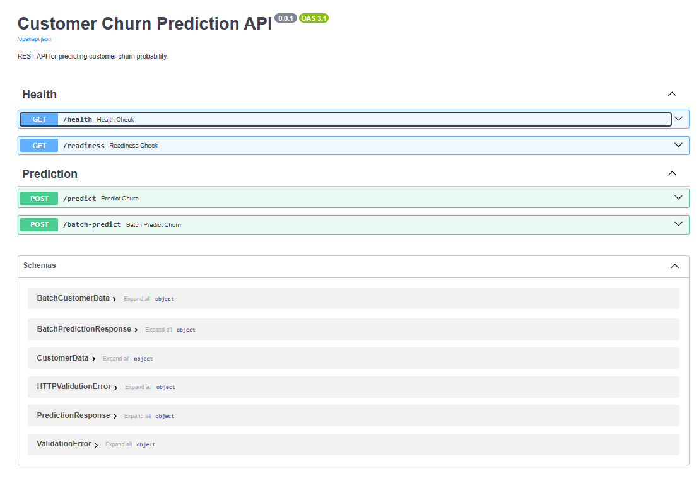

# Project Summary

This document outlines the development process, technical decisions, and steps taken to build this MLOps project.

## Overview
The goal was to design an end-to-end Machine Learning pipeline to predict customer churn. The solution includes model training, a REST API for inference, and containerization for deployment.

## Step 1: Environment & Setup
I started by setting up a clean Python environment. I used `uv` for faster dependency management.

```bash
# Environment creation
uv venv

# Dependency installation
uv pip install -r requirements.txt
```

## Step 2: Model Training
executed the `train_model.py` script to train the Random Forest Classifier. (Could be separated module but kept simple.)

> **Note on EDA:** A notebook `notebook/EDA.ipynb` is included to demonstrate the data analysis process using custom library.

```bash
python train_model.py
```

script used `customer_churn_dataset.csv`, handled preprocessing, and trained the model.

**Model Performance:**
*   **Accuracy**: 1.0
*   **Precision**: 1.0
*   **Recall**: 1.0

*We got perfect scores which indicates that dataset is likely small or potential overfitting. with real-world data, we would expect more differences.*

After training process we had artifacts in the `models/` directory:
1.  `churn_model.pkl`: The trained classifier.
2.  `preprocessing.pkl`: The encoders and scalers needed to transform new data.
3.  `metrics.pkl`: Performance metrics for version tracking.

## Step 3: API Development (FastAPI)
I developed the inference service using FastAPI in `src/main.py`.
*   **Endpoints**: Implemented `/predict` for single requests and `/batch-predict` for bulk processing.
*   **Validation**: Used Pydantic models to validate input types.
*   **Logging**: Implemented middleware to log request details and timing to `app_activity.log` for monitoring.

## Step 4: Containerization
I containerized it using Docker.
*  **Compose**: created `docker-compose.yml` to define the service, exposing port 8000. 
*  **Dockerfile**: Set up the environment with Python 3.12-slim and installed dependencies.

## Evidence of Working Deployment

### API Documentation (Swagger UI)


### Live Demo
[Watch the Evidence Video](screenshot/EvidenceVideo.mp4)

## How to Run

### Python (Local)
To start the service locally:
```bash
python run_api.py
# Access documentation at http://localhost:8000/docs
```

### Docker
**Run Production Build:**
--build means re-create the image no matter what!
```bash
docker compose up --build
```

**Run Local Dev (Hot Reload):**
```bash
docker compose -f docker-compose.local.yml up
```

**Run Tests:**
```bash
docker compose -f docker-compose.test.yml up --build --abort-on-container-exit
```

### Stopping & Cleaning
To stop the containers and remove the networks:
```bash
# Press Ctrl+C if attached, or run:
docker compose down

# For specific compose files:
docker compose -f docker-compose.local.yml down
```

To stop and also remove volumes:
```bash
docker compose down -v
```
